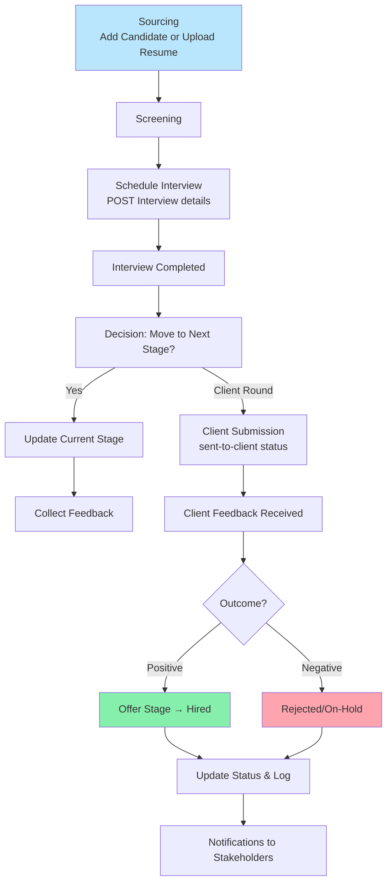

# Candidates Module Documentation

## Overview
Core module for managing candidate pipeline from sourcing to hiring. Tracks status, interviews, client submissions, feedback.

**Key Models**: Candidate, InterviewSchedule, ClientSubmission

**Candidate Statuses**: screening, interview-scheduled, sent-to-client, hired, rejected, on-hold

## End-to-End Candidate Flow Diagram



## Key APIs

### 1. Add Candidate
- **Endpoint**: `POST /api/v1/candidates/`
- **Request Body**:
  ```json
  {
    "job": "job-uuid",
    "candidate_name": "Rahul Sharma",
    "profile_name": "Senior Backend Engineer",
    "current_company": "Current Corp",
    "experience": "6 years",
    "current_location": "Bangalore",
    "contact": "9876543210",
    "email": "rahul@example.com",
    "current_ctc": 1500000,
    "expected_ctc": 2200000,
    "notice_period": "30 days",
    "resume": "(file upload)",
    "feedback": "Strong Python background"
  }
  ```
- **Response**: Candidate created with ID, status=screening, current_stage=first stage.

### 2. List Candidates
- `GET /api/v1/candidates/?job=job-id&status=screening`
- Supports filtering by job, status, stage.

### 3. Candidate Detail & Update
- `GET/PATCH /api/v1/candidates/{id}/`
- Update status, feedback, move stages.

### 4. Schedule Interview
- Part of candidate update or dedicated.
- **Example Body**:
  ```json
  {
    "date": "2024-01-15",
    "time": "14:30:00",
    "mode": "online",
    "interviewer_name": "Tech Lead",
    "notes": "Focus on system design"
  }
  ```

### 5. Client Submission
- When moving to client round:
  - Creates ClientSubmission record.
  - Updates status to `sent-to-client`.

### 6. Calendar Events
- `GET /api/v1/candidates/calendar/events/` - For interview scheduling view.

### 7. Public Resume Upload
- `POST /api/v1/candidates/upload/{job_id}/` - Public endpoint for candidates.

## Pipeline Steps (Detailed)
1. **Sourcing**: Recruiter adds candidate or candidate uploads via shared link.
2. **Screening**: Review resume, initial feedback.
3. **Interview Scheduling**: Set date/time/mode, notify all parties.
4. **Round Progression**: Update current_stage after each round with feedback.
5. **Client Submission**: Send profile to client with details.
6. **Client Feedback**: Update with client_rating, client_feedback.
7. **Offer/Negotiation**: Move to offer stage, discuss CTC.
8. **Final Status**: HIRED (update records) or REJECTED with reason.
9. **Documentation**: All changes create AuditLog entries.

## Sample Response for Candidate
```json
{
  "id": "cand-uuid",
  "job": "job-uuid",
  "candidate_name": "Rahul Sharma",
  "status": "interview-scheduled",
  "current_stage": {"name": "Technical", "order": 3},
  "interview_schedule": {
    "date": "2024-01-15",
    "time": "14:30:00",
    "mode": "online"
  },
  "feedback": "Good problem solving skills",
  "resume_file_name": "rahul_resume.pdf"
}
```

## Integration
- **Jobs**: Candidates belong to a Job with its stages.
- **Accounts**: Created_by recruiter, interviewers from users.
- **Notifications**: Interview reminders, status change alerts.
- **Audit**: Every status update, interview schedule logged.
- **Common**: Uses BaseModel for timestamps, soft deletes.

**Note**: Soft delete (is_deleted flag) used instead of hard delete for compliance.
