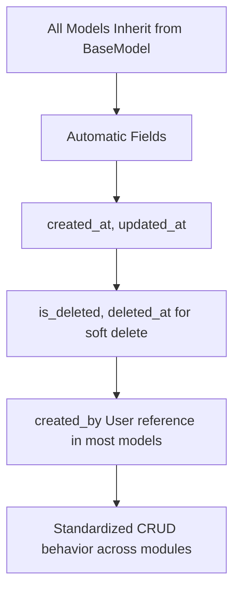

# Common Module Documentation

## Overview
Shared utilities, base models, permissions, and helper functions used across all modules.

**Key Components**:
- BaseModel (with timestamps, soft delete support)
- Custom Permissions (role-based)
- Utils for logging, notifications, etc.

## Base Model Flow



## Key Features

### 1. Permissions
- `IsAdmin`, `IsManager`, `IsRecruiter`
- `IsAdminOrManager`
- Used in all ViewSets and APIViews
- Example from accounts/views.py:
  ```python
  permission_classes = [IsAdminOrManager]
  ```

### 2. BaseModel (common/models.py)
```python
class BaseModel(models.Model):
    created_at = models.DateTimeField(auto_now_add=True)
    updated_at = models.DateTimeField(auto_now=True)
    is_deleted = models.BooleanField(default=False)
    deleted_at = models.DateTimeField(null=True, blank=True)
    # ... soft delete methods
```

Most models (Client, Job, Candidate, etc.) inherit from this.

### 3. Utilities
- `audit.utils.log_action(user, action, target_type, target_id, description)`
- Notification helpers
- Permission mixins

## Role-Based Access Control Flow
1. User logs in with role (from accounts.UserRole)
2. Request comes with JWT token
3. Permission classes check request.user.role
4. Admin: Full access
5. Manager: Can manage their recruiters, their jobs, all clients
6. Recruiter: Limited to assigned jobs and their candidates

## Shared Components Used in A-Z Process
- **Login to Dashboard**: Base auth and permissions
- **Client/Job Creation**: BaseModel timestamps + created_by
- **Candidate Pipeline**: Soft delete for candidates (instead of removing records)
- **All Actions**: Routed through audit logging utility
- **Error Responses**: Standardized validation error format with `field_errors`

## API Response Patterns (Common)
**Success**:
- 200/201 with data
- Consistent pagination using DRF

**Error**:
```json
{
  "error": "Validation failed",
  "field_errors": {
    "email": ["This field is required."],
    "password": ["Password too short."]
  }
}
```

This module ensures consistency across the entire application from authentication to final candidate status updates.
